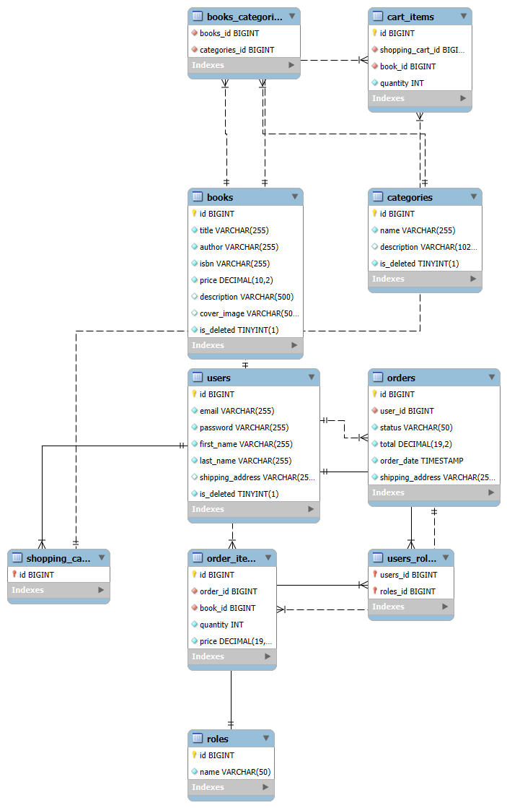

## 📘 Bookstore API 📘

### Intro
Welcome to the Bookstore Backend — a scalable, modular RESTful API built with Java and Spring Boot. 
This project powers a comprehensive online bookstore, offering endpoints to manage users, books, orders, and other core functionalities, all while ensuring strong security and thorough documentation.
The main technology behind the project is Java and Spring Boot. It has all the necessities of a modern day Web application, an online store in particular. Let me show you the details!

The system is designed following a Layered Architecture, which ensures clear separation of concerns, easier maintenance, and future scalability. 
It integrates modern backend technologies and tools to simplify development, improve testing and deployment processes, and enhance security.
---

### [!Demo video!](https://youtu.be/jdfeNZUkPsA)

---
### Challenges faced
- Configuring Docker to work with an existing MySQL database running inside a container
- Deploying and launching the initial Docker image on an AWS EC2 instance
- Setting up and mastering MapStruct configuration
---
### Tech stack
- Java 17
- Spring Boot 3.4.3
- Spring Data JPA 3.4.3
- Spring Security 6.4.3
- MySql 8.0.33
- Docker 3.4.1
- Mapstruct 1.6.3
- Swagger
- AWS - EC2, ECR, RDS
---
### Functionality
1. Registration, authentication and authorization:
    - User registration (`POST /auth/registration`) and login (`POST /auth/login`) endpoints are provided.
    - JWT token after successful login
    - Roles functionality (Admin and User(customer)).
    - The fields of both requests are validated By Hibernate validator!
2. Book creation, searching, update and deletion (CRUD):
    - Admin users have permissions to create (`POST /books`), update (`PUT /books/{id}`), and delete (`DELETE /books/{id}`) books in the store.
    - As a customer/user, I am able to see all books(`GET /books`), perform parametrized search of books(`GET /search`), search by book id(`GET /books/{id}`).
3. Category management (CRUD operations):
    - Admins can perform full CRUD operations on categories (`POST/GET /categories`, `PUT/DELETE /categories/{id}`).
    - User is able to retrieve categories by id(`GET /categories/{id}`), see all of them OR find all books that belong to a particular category, e.g. science fiction books(`GET /categories/{id}/books`).
4. Shopping cart:
    - User is able to see his cart(`GET /cart`), add book items to it via book id and desired quantity(`POST /cart`).
    - Optionally, user may modify his cart item quantity by cart item id(`PUT /cart/items/{id}`) or delete it(`DELETE /cart/items/{id}`).
5. Order functionality:
    - User is able to see his orders (`GET /orders`),
    - Create a new order using a provided address and items in his shopping cart(`POST /orders`).
    - Retrieve details of a specific order by order ID (`GET /orders/{orderId}/items`) or details of a specific order item using order ID and item ID (`GET /orders/{orderId}/items/{orderItemId}`).
    - Admin is able to modify/update order status, e.g. "Order placed" -> "Processing"(`PUT /orders/{id}`).
---
### EER Diagram

---
### How to run and build the project locally
- Install:
    - Java 17
    - Maven
    - MySQL
    - Docker
- Clone the repository
- Create an env file (a template is provided, see "env.template" file)
- Run the following commands:
```
mvn clean install
docker-compose build
docker compose up
```
- Launch Swagger locally via the
```
http://localhost:8080/swagger-ui/index.html
```
